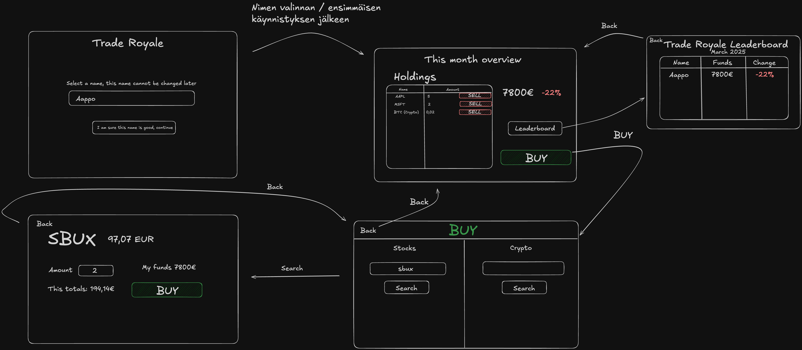

# Vaatimusmäärittely

## Sovelluksen tarkoitus

Sovelluksen tarkoitus on tuottaa opettavaisia ja hauskoja pelihetkiä. Sovellus on siis osake- ja kryptomarkkina peli/simulaattori, jossa tavoitellaan kuukausittain suurinta tuottoa **leikkirahoille**.

## Käyttöliittymäluonnos

Sovellus koostuu neljästä eri näkymästä

Sovellus aukeaa ensimmäisellä käynnistyksellä nimenvalintanäkymään, josta on mahdollista siirtyä muihin näkymiin valitsemalla itselleen nimen. Nimen valittua muissa näkymissä voi seikkailla vapaasti, mutta nimenvalinta näkymään ei enää pääse.

## Perusversion tarjoama toiminnallisuus

### Käyttäjätilin luonti

- Käyttäjä voi valita nimimerkin, jota ei voi myöhemmin vaihtaa.

### Salkun hallinta

- Käyttäjä voi nähdä salkkunsa arvon ja prosentuaalisen muutoksen.
- Käyttäjä voi tarkastella omistamiaan osakkeita ja niiden määriä.
- Käyttäjä voi myydä osakkeita yhdellä napin painalluksella.

### Osakkeiden ja kryptovaluuttojen ostaminen

- Käyttäjä voi hakea osakkeita ja kryptovaluuttoja nimellä tai tickerillä.
- Käyttäjä voi nähdä osakkeen tai kryptovaluutan hinnan euroissa.
- Käyttäjä voi syöttää ostettavan määrän ja nähdä kokonaishinnan.
- Käyttäjä voi ostaa osaketta salkkuunsa

### Navigointi ja käytettävyys

- Käyttäjä voi käyttää Takaisin -painiketta siirtyäkseen edelliseen näkymään.

## Jatkokehitysideoita

Perusversion jälkeen järjestelmää täydennetään ajan salliessa esim. seuraavilla toiminnallisuuksilla:

- Käyttäjä näkee enemmän tietoja osakkeista ostohaku näkymässä.
- Käyttäjä voi vaihtaa sovelluksen vakiovaluuttaa.
