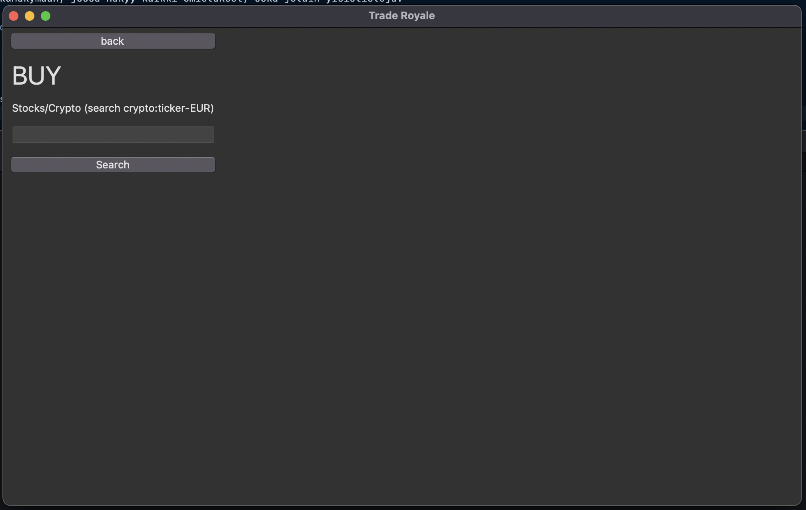

# Vaatimusmäärittely

## Sovelluksen tarkoitus

Sovellus on osake- ja kryptomarkkina simulaattori. Sovelluksen tarkoitus on tuottaa opettavaisia ja hauskoja kokemuksia osakkeiden parissa. Käyttäjien tileillä on **leikkirahaa**.

## Käyttöliittymäluonnos

Sovellus koostuu kolmesta eri näkymästä

Sovellus aukeaa Salkkunäkymään, jossa näkyy kaikki omistukset, sekä jotain yleistietoja.

## Perusversion tarjoama toiminnallisuus

### Salkku

- Käyttäjä voi nähdä osakkeidensa arvon ja prosentuaalisen muutoksen. **TEHTY**
- Käyttäjä voi tarkastella omistamiaan osakkeita ja niiden määriä. **TEHTY**

### Osakkeiden ja kryptovaluuttojen ostaminen

- Käyttäjä voi hakea osakkeita ja kryptovaluuttoja tickerillä. **TEHTY**
- Käyttäjä voi nähdä osakkeen tai kryptovaluutan hinnan euroissa. **TEHTY**
- Käyttäjä voi ostaa osaketta salkkuunsa **TEHTY**

### Navigointi ja käytettävyys

- Käyttäjä voi navigoida kolmen eri näkymän välillä **TEHTY**

## Jatkokehitysideoita

Perusversion jälkeen järjestelmää täydennetään ajan salliessa esim. seuraavilla toiminnallisuuksilla:

- Käyttäjä näkee enemmän tietoja osakkeista ostohaku näkymässä.
- Käyttäjä voi vaihtaa sovelluksen vakiovaluuttaa.
