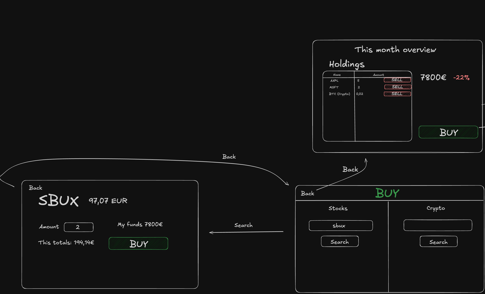

# Vaatimusmäärittely

## Sovelluksen tarkoitus

Sovelluksen tarkoitus on tuottaa opettavaisia ja hauskoja pelihetkiä. Sovellus on siis osake- ja kryptomarkkina peli/simulaattori, jossa tavoitellaan kuukausittain suurinta tuottoa **leikkirahoille**.

## Käyttöliittymäluonnos

Sovellus koostuu kolmesta eri näkymästä

Sovellus aukeaa Salkkunäkymään, jossa näkyy kaikki omistukset, sekä jotain yleistietoja.

## Perusversion tarjoama toiminnallisuus

### Salkun hallinta

- Käyttäjä voi nähdä salkkunsa arvon ja prosentuaalisen muutoksen.
- Käyttäjä voi tarkastella omistamiaan osakkeita ja niiden määriä.
- Käyttäjä voi myydä osakkeita yhdellä napin painalluksella.

### Osakkeiden ja kryptovaluuttojen ostaminen

- Käyttäjä voi hakea osakkeita ja kryptovaluuttoja nimellä tai tickerillä.
- Käyttäjä voi nähdä osakkeen tai kryptovaluutan hinnan euroissa.
- Käyttäjä voi syöttää ostettavan määrän ja nähdä kokonaishinnan.
- Käyttäjä voi ostaa osaketta salkkuunsa

### Navigointi ja käytettävyys

- Käyttäjä voi navigoida kolmen eri näkymän välillä

## Jatkokehitysideoita

Perusversion jälkeen järjestelmää täydennetään ajan salliessa esim. seuraavilla toiminnallisuuksilla:

- Käyttäjä näkee enemmän tietoja osakkeista ostohaku näkymässä.
- Käyttäjä voi vaihtaa sovelluksen vakiovaluuttaa.
