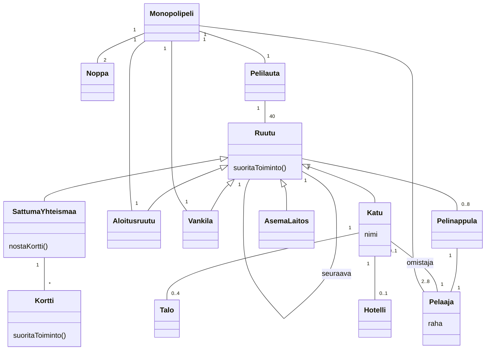

## Monopoli luokkakaavio

```mermaid
classDiagram
Monopolipeli "1" -- "2" Noppa
Monopolipeli "1" -- "1" Pelilauta
Pelilauta "1" -- "40" Ruutu
Ruutu "1" -- "1" Ruutu : seuraava
Ruutu "1" -- "0..8" Pelinappula
Pelinappula "1" -- "1" Pelaaja
Pelaaja "2..8" -- "1" Monopolipeli

    class Ruutu{
        suoritaToiminto()
    }
    Ruutu <|-- Aloitusruutu
    Ruutu <|-- Vankila
    Ruutu <|-- SattumaYhteismaa
    Ruutu <|-- AsemaLaitos
    Ruutu <|-- Katu

    Monopolipeli "1" -- "1" Aloitusruutu
    Monopolipeli "1" -- "1" Vankila

    class SattumaYhteismaa{
        nostaKortti()
    }
    SattumaYhteismaa "1" -- "*" Kortti
    class Kortti{
        suoritaToiminto()
    }

    class Katu{
        nimi
    }
    Katu "1" -- "0..4" Talo
    Katu "1" -- "0..1" Hotelli
    Katu "0..1" -- "1" Pelaaja : omistaja

    class Pelaaja{
        raha
    }
```
