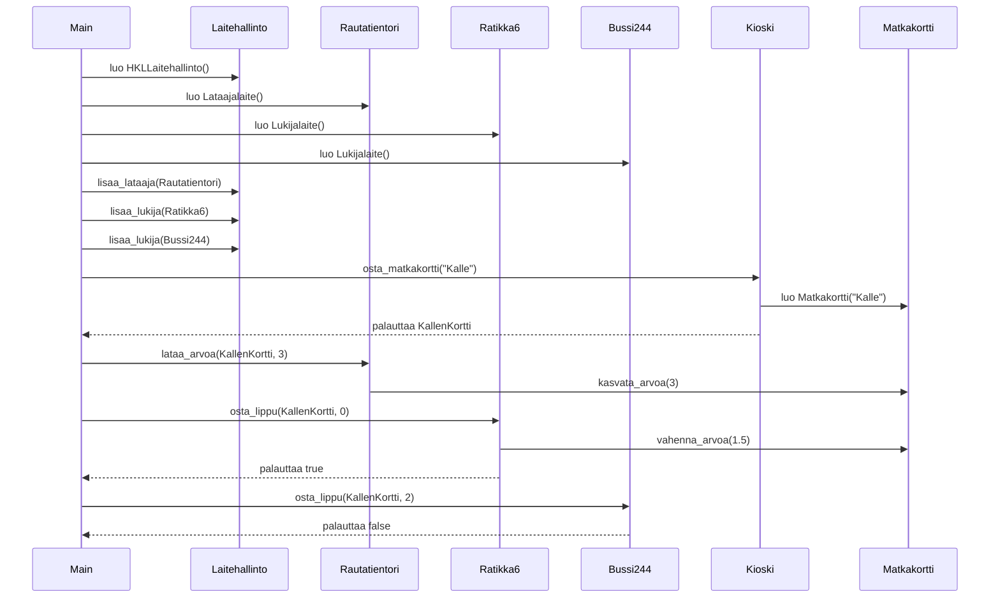

## Sekvenssikaavio

```mermaid
sequenceDiagram
    Main->>Laitehallinto: luo HKLLaitehallinto()
    Main->>Rautatientori: luo Lataajalaite()
    Main->>Ratikka6: luo Lukijalaite()
    Main->>Bussi244: luo Lukijalaite()

    Main->>Laitehallinto: lisaa_lataaja(Rautatientori)
    Main->>Laitehallinto: lisaa_lukija(Ratikka6)
    Main->>Laitehallinto: lisaa_lukija(Bussi244)

    Main->>Kioski: osta_matkakortti("Kalle")
    Kioski->>Matkakortti: luo Matkakortti("Kalle")
    Kioski-->>Main: palauttaa KallenKortti

    Main->>Rautatientori: lataa_arvoa(KallenKortti, 3)
    Rautatientori->>Matkakortti: kasvata_arvoa(3)

    Main->>Ratikka6: osta_lippu(KallenKortti, 0)
    Ratikka6->>Matkakortti: vahenna_arvoa(1.5)
    Ratikka6-->>Main: palauttaa true

    Main->>Bussi244: osta_lippu(KallenKortti, 2)
    Bussi244-->>Main: palauttaa false
```
